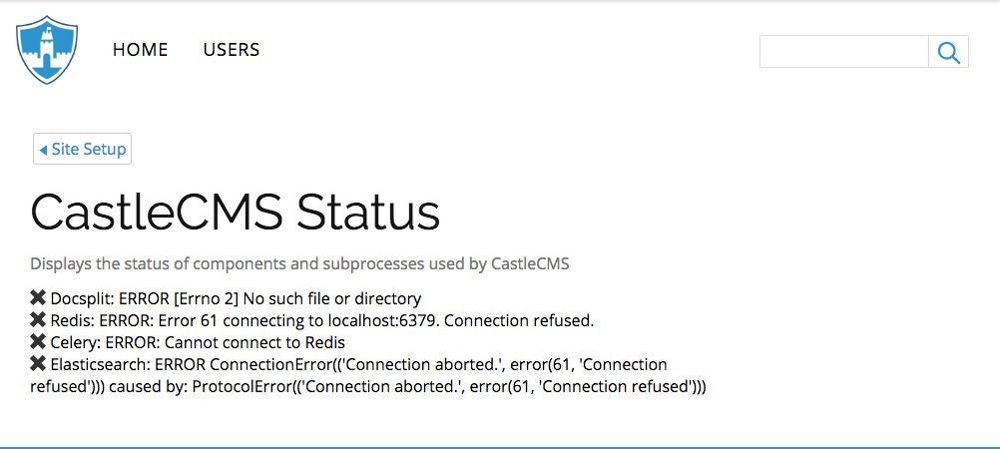
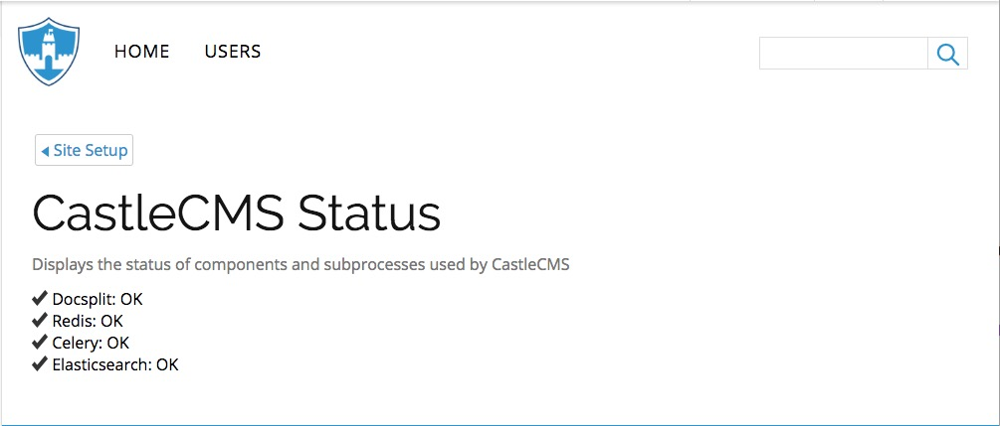

CastleCMS Control Panels
========================

The following describes CastleCMS' control panels, which an administrator uses
to configure, control, and view the current state of CastleCMS and its subprocesses.

CastleCMS Settings
------------------

Default
~~~~~~~

Catch-all settings related to content locations and file sizes.

APIs
~~~~

Configure integrated APIs like S3, Plivio, Google Analytics and Cloudflare.

Archival
~~~~~~~~

To automatically archive content to an S3 bucket.

Content
~~~~~~~

- File upload fields: Fields that should up on the file upload form. This allows you
  to require particular fields and/or add more fields for a user to be able
  to fill in while uploading files.

Announcements
-------------

Manage Categories
~~~~~~~~~~~~~~~~~

- Subscribers to export: This form is used to export a CSV including all the
  subscribers that are subscribed to at least one of the categories specified. If
  no categories are specified, all subscribers are exported.

- Import Subscribers: The import form is used to import a CSV generated by the
  export form. For each user in the CSV, the import process will either import the
  subscriber or update the subscribers subscriptions, depending on if the subscriber
  is already in the system or not. If any of the subscribers in the CSV are subscribed
  to a category that isn't registered in the system, the category will be added.

- New category: This form can be used to add one or more categories for users to
  subscribe to. To add multiple categories, separate each category name with a
  semicolon.

- Categories to rename or merge: The purpose of this form is to rename or merge existing
  categories. To rename, only select the category to be renamed. To merge, select all of
  the categories to merge into one. Below is a field for the new category name.

- Categories to delete: This form will attempt to delete any categories provided to it.
  Categories with no subscribers will be successfully deleted. Categories with one or
  more subscribers will be skipped. To delete a category regardless of whether or not
  it has any subscribers, check the "force delete" checkbox.

Status Control Panel
--------------------
The CastleCMS status control panel checks and displays the status of components
and subprocesses needed by CastleCMS.

- `docsplit`: checks if the docsplit tool is installed and available to used
  by the document viewer.

- `Celery`: checks if CastleCMS is able to connect to a Celery worker,
  which is used to process queued tasks.

- `Redis`: checks if CastleCMS is able to connect to Redis, which acts as a task queue.

- `Elasticsearch`: checks if CastleCMS is able to connect to the Elasticsearch
  search engine.

Here is what the status control panel looks like if CastleCMS' subcomponents
and subprocesses are not available or running:

   CastleCMS Status control panel showing errors

Here is what the status control panel looks like if all components and subprocesses
are present and functioning:

   CastleCMS Status control panel showing all OK

Keyword Manager Control Panel
-----------------------------

The Keyword Manager (Products.PloneKeywordManager) is useful for renaming and
merging keywords (aka tags or subjects). Upon loading the page, it will list all
keywords used across the current site.

The checkboxes next to each keyword are used to determine which keywords to
rename and/or merge. All selected keywords will be renamed to the value of the
"Keyword to apply" field.

Toggling the "Show similar keywords" checkbox, Keyword Manager can group similar
keywords with each keyword. Be warned that this will produce duplicate entries
on the page if duplicates are found.

Social media integration
------------------------

The `Social Media Settings` control panel allows you to specify social media
accounts Castle can integrate with.

In addition to that, you can authenticate Twitter and YouTube accounts to
allow Castle to perform actions on your behalf.

In order to authenticate against Twitter and YouTube, you must provide provide
oauth client id and secrets for those services.

The can be configured on the environment with these environment settings:

 - `TWITTER_CLIENT_KEY`
 - `TWITTER_CLIENT_SECRET`
 - `GOOGLE_CLIENT_ID`
 - `GOOGLE_CLIENT_SECRET`

(you can also provide twitter auth key and secret through control panel; however,
in the future, these will all be environment variables)