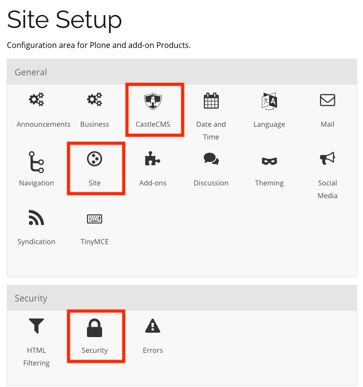
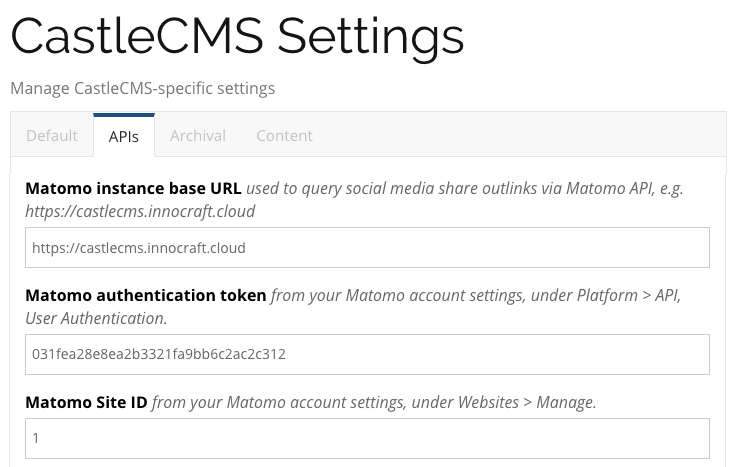
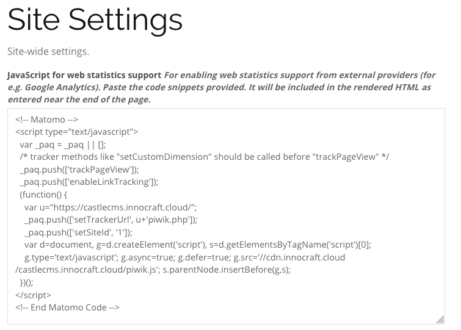
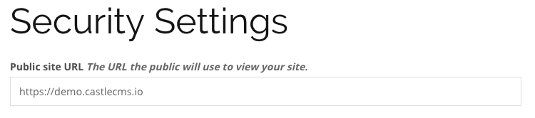
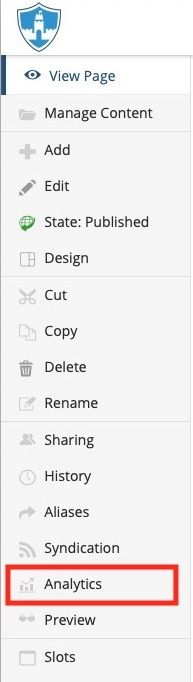
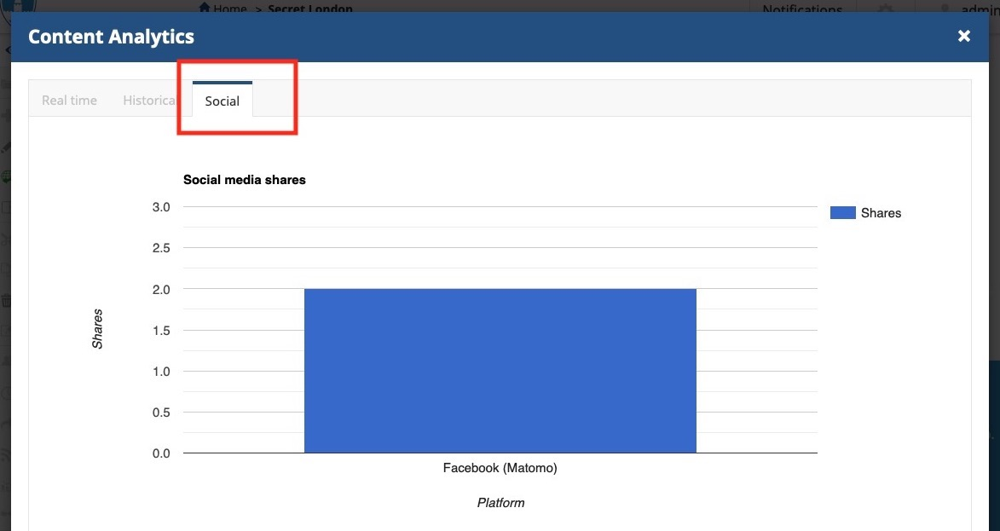

Matomo
======

CastleCMS can be configured to use Matomo to track and display the number of shares of your website content to
Twitter and Facebook.

To configure this, you must do the following:

- go to Site Setup > CastleCMS Settings, "APIs" tab, and fill in the values for:

  - Matomo instance base URL: the URL of your Matomo server, e.g. "https://yourorganization.innocraft.cloud"
  - Matomo Site ID: an integer, e.g. "1", from your Matomo account settings, under Websites > Manage
  - Matomo authentication token: a string of digits and letters, from your Matomo account settings, under Platform > API, User Authentication

- go to Site Setup > Site, and ensure that "JavaScript for web statistics support" contains your Matomo tracking code, which you can find using the `Matomo JavaScript Tracking Client instructions <https://developer.matomo.org/guides/tracking-javascript-guide#outlink-tracking-exclusions>`_

- go to Site Setup > Security, and ensure that the "Public site URL" is set, e.g. "https://demo.castlecms.io". If it is not set, the `social-counts` script will not check this site for social share counts.

A system administrator must run the `social-counts` script periodically, ideally scheduled to run daily via `crontab`.

The script will use a Matomo API to retrieve the number of times each *published* content item has been shared
by clicking on the Twitter or Facebook button in the CastleCMS sharing buttons tile.

This count will *not* include shares of your website content that did not result from clicking on those buttons.

To view Matomo social share counts:

- navigate to any content item in your website
- click the Analytics toolbar button

- click the Social tab; if the `social-counts` script has run and has retrieved share counts of the current content item from Matomo for Twitter or Facebook, it will display them in a chart

